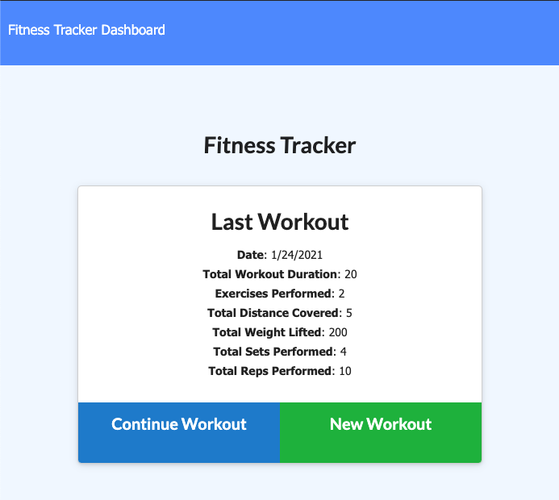
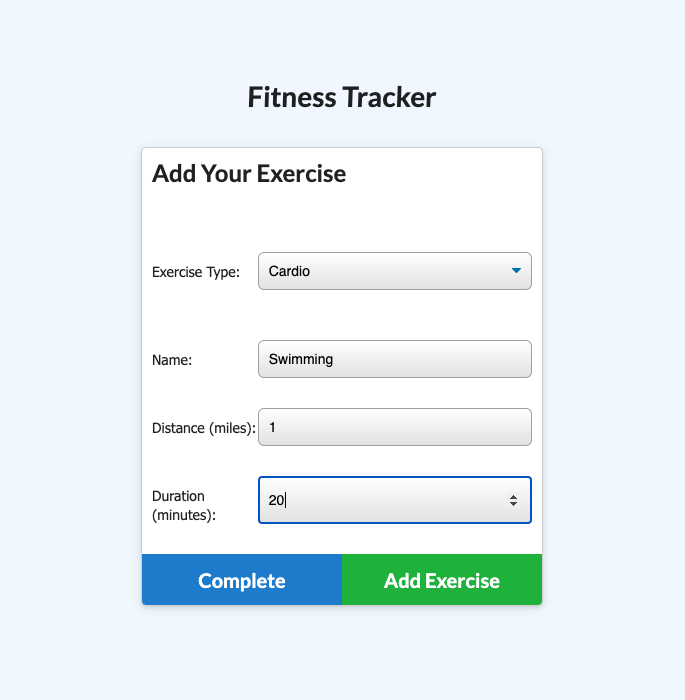
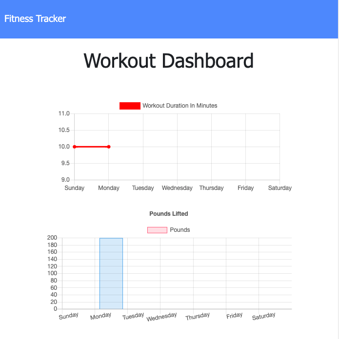

# 17_Fitness_Tracker

This exercise tracker allows users to track the exercises of their workouts. It gives a summary of the last workout and the dashboard shows visualizations of previous workout data.

## Table of contents

- [Usage](#usage)
- [License](#license)
- [Contributions](#contributions)
- [Tests](#tests)
- [Questions](#Questions)

## Usage

Visit <https://whispering-bastion-31670.herokuapp.com/>

## License

## Contributions

Please email regarding any contributions.

## Tests

Currently, there are no tests.

## Questions

For any questions, please email <gregstead@gmail.com>
Or [visit my github](https://github.com/gregstead/)
